# I LIKE VANILLA! 
> ## The Storybook of My CSS & BS5 & VanillaJS Learning Process..
This repository includes the resources provided to me via patika.dev while learning HTML, CSS, and JavaScript, along with the notes I took during the lessons and the practice projects I built based on them. It also contains the resulting website I created while experimenting with what I learned. Throughout this process, I made significant progress in using tools and technologies such as VS Code, Git, Git Bash, GitHub, GitHub CLI, Node, npm, and Bootstrap.
Once the site is complete, I will update this README file and provide a sitemap. For my next project, I plan to use React and Tailwind CSS!! Wish me luck :)

Screenshots:

landing page:
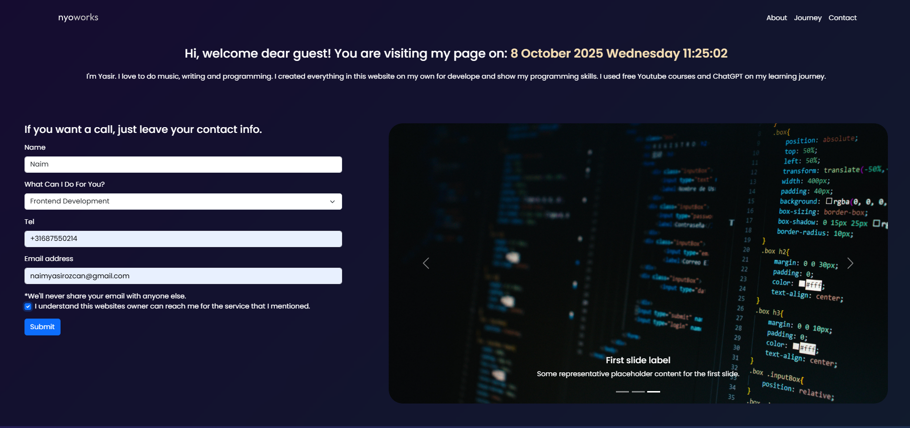

cards and list:
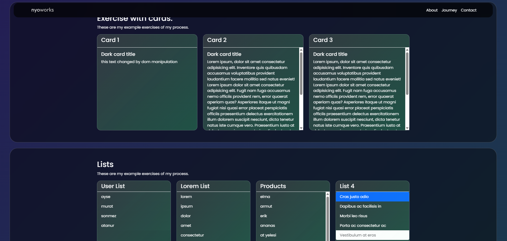

content section:
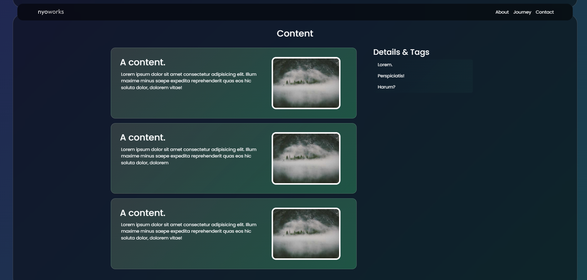

related content and aside:
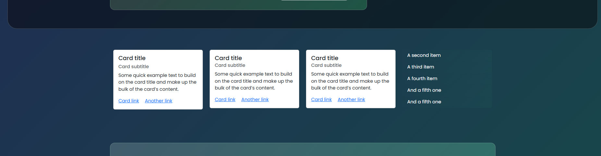

toss game:

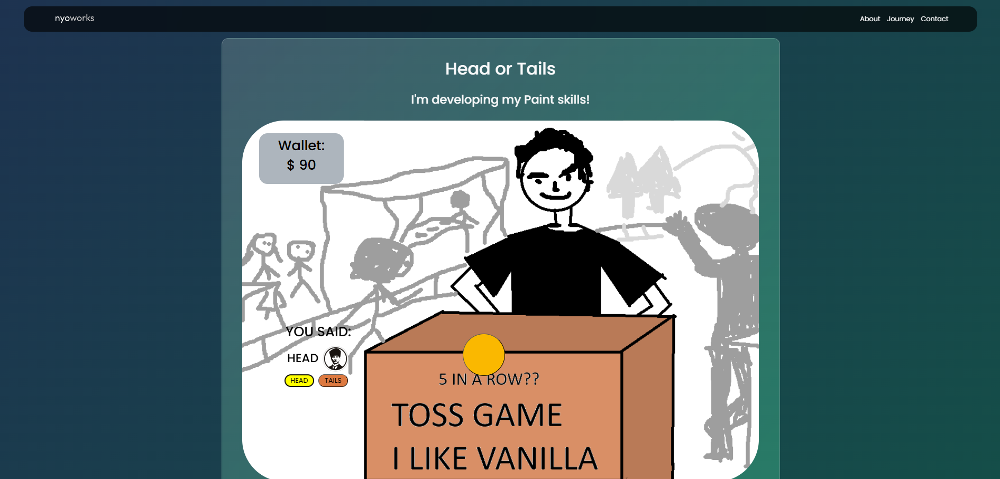

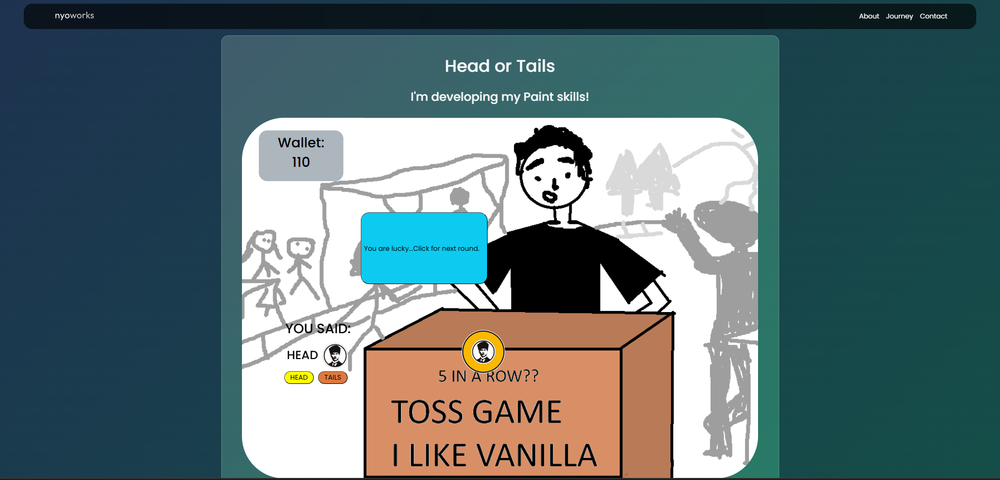

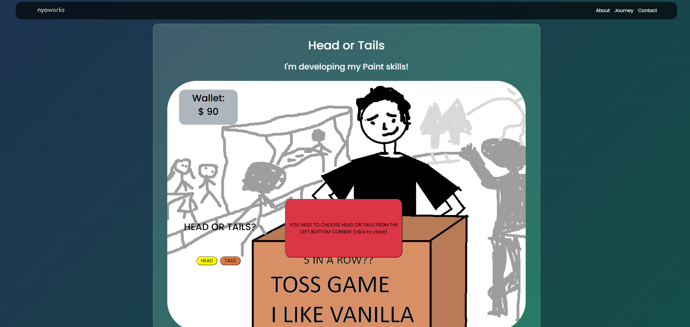

mini applications:
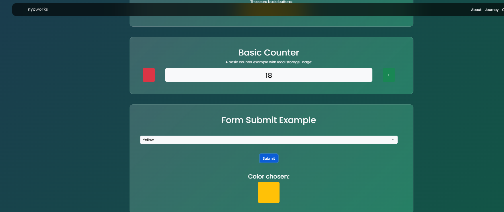

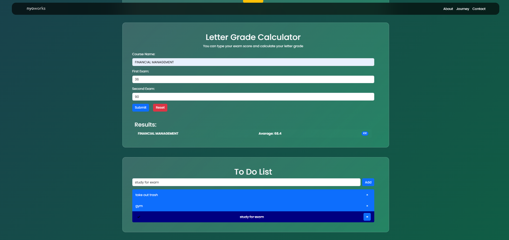

a face with css:
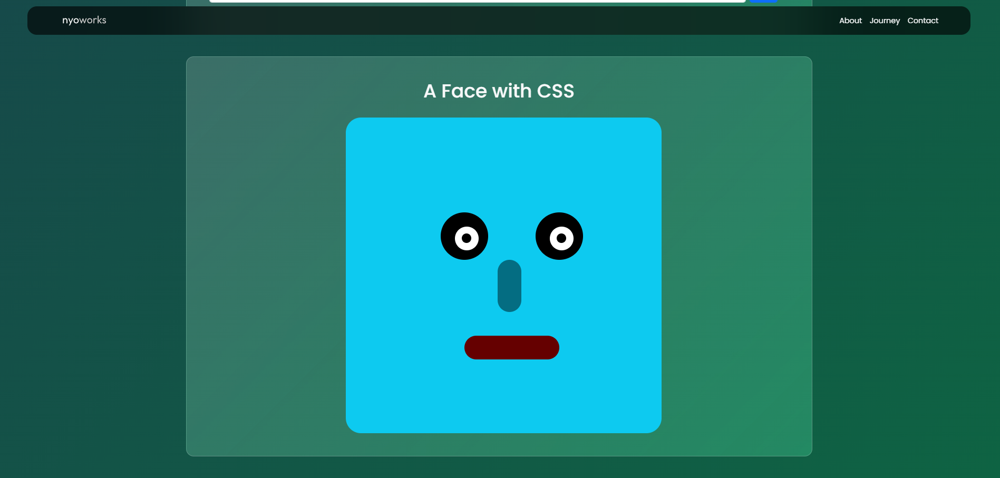

aaand the footer:
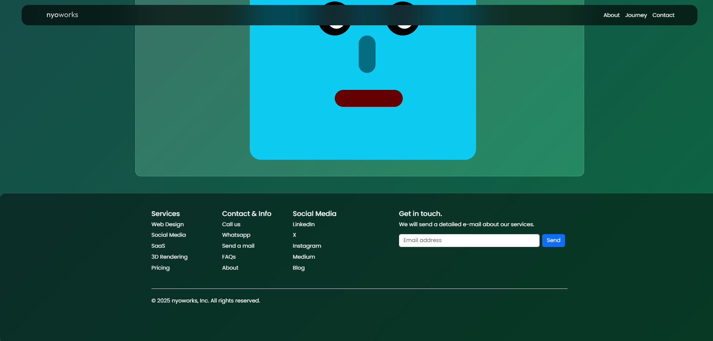

i've tried to use only my knowledge and basic bootstrap layout, it was a hard but very efficient experience. i hope you enjoy, cheers.